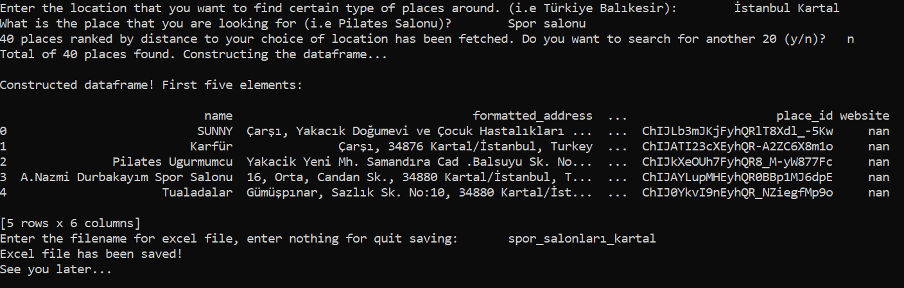

# Nearby_Places_Script
A small python script written with Google Places API

Usage example:

An example run is given under example folder. After running `python main.py` on console like this:

The result gets saved into "spor_salonları_kartal.xlsx". You can also find this file at example folder.
